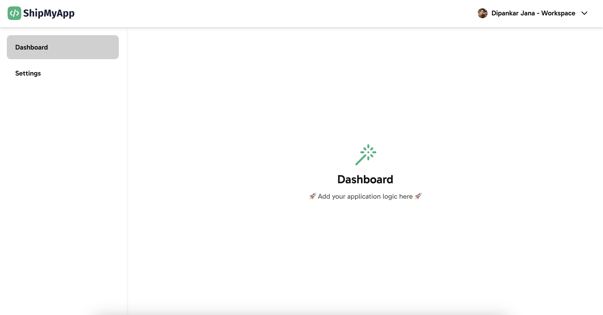

# Accordion

```typescript
import { FAQ } from "@/components/faq";
```

The FAQ component is organized as follows. You can add as many of these as per your needs. Each question can be expanded to show the answer. Make sure to add the most commonly asked questions. Also, you can add a support email if needed.

```tsx
<Accordion heading="What am I getting?">
  ShipMyApp is available as a one-time-purchase to access the Github repository. You will get lifetime accesss to the respository and all future updates.
</Accordion>
<Accordion heading="TypeScript or JavaScript?">
  The main repository is written in TypeScript. However, we also provide a JavaScript version for those who prefer it.
</Accordion>
<Accordion heading="Can I use it if my tech stack is not based on Next.js?">
  You can still use it as a reference. However, the code is optimized for Next.js and may require some modifications to work with other frameworks. If you framework is React but without Next.js, you can still use the components, pages and styles.
</Accordion>
```

<figure><figcaption><p>FAQ section in shipmyapp.com</p></figcaption></figure>
