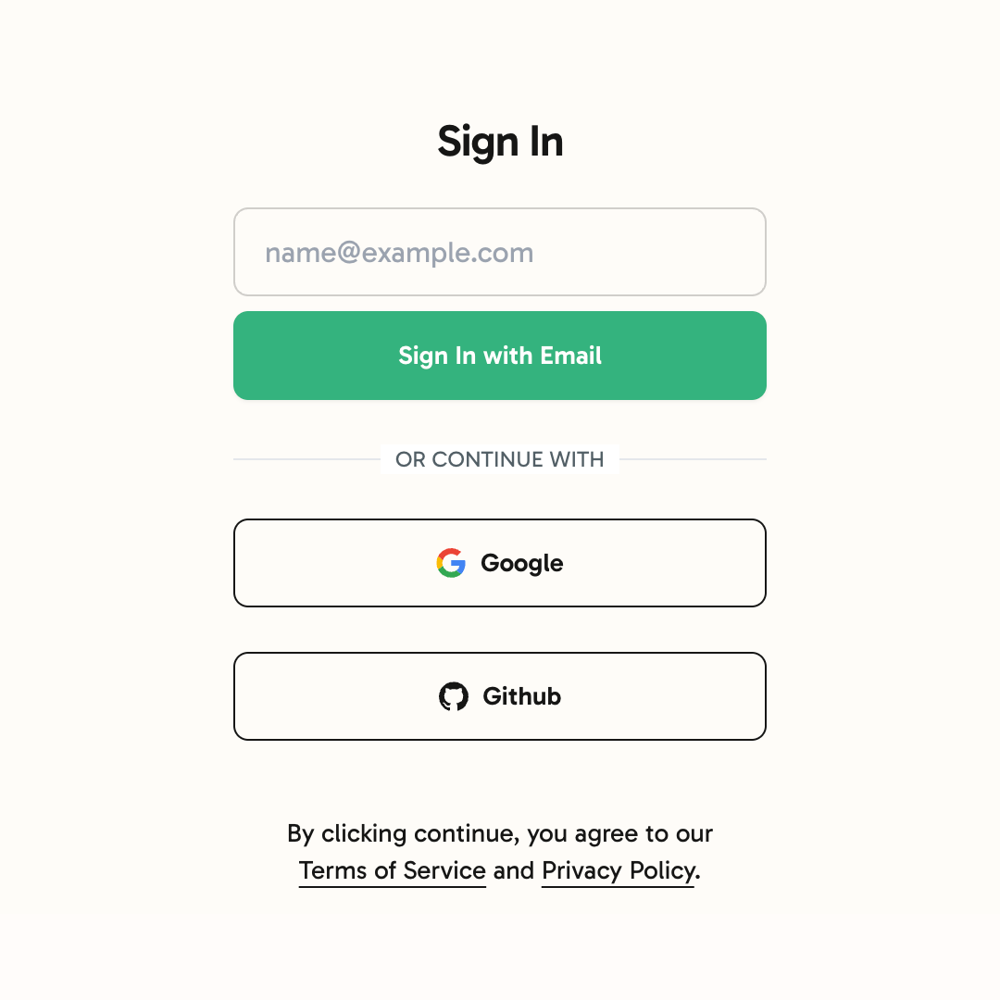

# 👨‍💼 User Authentication

ShipMyApp supports [NextAuth](https://next-auth.js.org/) to authenticate users. You can configure it in the `/src/app/api/auth/[...nextauth]/route.ts` file.

With NextAuth you can create two types of authentications such as Magic Links and Social Authentication using Google and Github.

<figure><figcaption><p>Login Page</p></figcaption></figure>

### Configuring Google OAuth

1. Login to [https://console.cloud.google.com/](https://console.cloud.google.com/)
2. Create a new Project under **`APIs & Services`**
3. Navigate to **`OAuth consent screen`**
4. Fill in all the required details.
5. Set the scope to `userinfo.email` and `userinfo.profile`
6. Submit
7. Navigate to **`Credentials`**
8. Click on **`Create Credentials`**

<figure><figcaption></figcaption></figure>

9. Select **`OAuth Client ID`**
10. Select **`Web Application`**
11. Add http://localhost:3000 and https://yoursitename.com into the Authorized JavaScript Origins.
12. Add `http://localhost:3000/api/auth/callback/google` and `https://yoursitename.com/api/auth/callback/google` to Authorized redirect URLs.
13. Click **`Submit`**
14. Copy and paste the Client ID and Client Secret into the `.env` file as shown in [environment-variables.md](../environment-variables.md "mention")

```
GOOGLE_CLIENT_ID=""
GOOGLE_CLIENT_SECRET=""
```

15. Go to "**OAuth Consent Screen**" and click "**Publish App**".
16. Google might request you to verify your domain in [Google Search Console](https://search.google.com/search-console). It requires you to configure a CNAME or TXT DNS record.

#### 👏 That is all. Now that you have setup the basic OAuth settings, the Google Login is already configured in the project. You should be able to login now.
