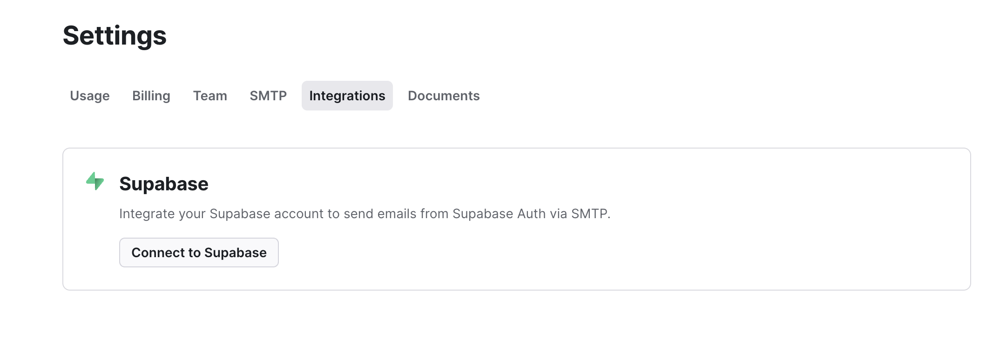

# 🔐 Supabase Auth

Using supabase as authenticaion is bit of a manual process. ShipMyApp support three major ways to sign up a user.

1. Good old email and password
2. Using Google OAuth and Github OAuth
3. Using magic links

Let's checkout the `supabase` branch first.

```git
git checkout supabase
```

The authentication flow is sepearate in to multiple routes for each step and scenarios. It looks like the following.

```tsx
<SupabaseLogin />
<SupabaseRegister />
<SupabaseResetPassword />
<SupabaseVerifyEmail />
<SupabaseVerifyPasswordChange />
<SupabaseForgotPassword />
<SupabaseAuthError />
```

1. Go ahead and create an account at [https://supabase.com/](https://supabase.com/)
2. Get your `SUPABASE_URL` and `SUPABASE_ANON_KEY` from the dashboard.
3. Paste them into the environment variables as shown below.


```
NEXT_PUBLIC_SUPABASE_URL=
NEXT_PUBLIC_SUPABASE_ANON_KEY=
```


To enable OAuth, navigate to [https://supabase.com/dashboard/project/YOUR\_SUPABASE\_URL/auth/providers](https://supabase.com/dashboard/project/YOUR\_SUPABASE\_URL/auth/providers)

To enable OAuth providers, check the checkboxes.

<figure><figcaption><p>Supabase Auth Providers Settings</p></figcaption></figure>

### Email

By default, supabase's built-in email sending mechanism is rate limited. To overcome this, you will need to integrate a custom email server in supabase's settings. We are going to use Resend for this.

1. Go to the SMTP Settings in supabase dashboard.

<figure><figcaption></figcaption></figure>

2. Turn on `Enable Custom SMTP` as shown in the screenshot above. It will ask you to configure your client using host and port number etc. Thankfully, a supabase integration exists that will help you set these up automatically.
3. Go to [https://supabase.com/partners/integrations/resend](https://supabase.com/partners/integrations/resend) . This will take you to  [https://resend.com/settings/integrations](https://resend.com/settings/integrations) and you can add your integration over there. Just fill up the form, you're good to go.

<figure><figcaption></figcaption></figure>

<figure><figcaption></figcaption></figure>

After your integration is done. You should be able to send emails.
